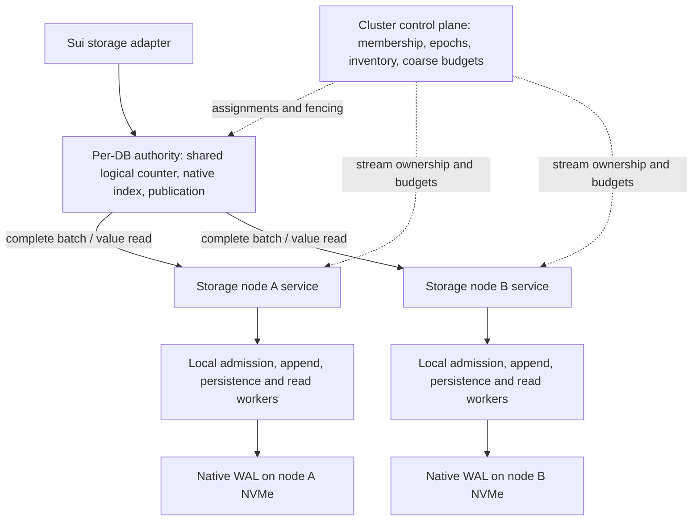

# Next implementation plan: database authority and distributed Value WAL

Date: 6 October 2026. **Implementation plan; unfinished work is identified below.**

## 1. Repository state and priority

The fork's remote `main` and MystenLabs `upstream/main` were fetched again and both
resolved to `ce37b18e6c2ffb8e46b7d8c1bf136c9366a7642d`. No upstream commits were
missing. The implementation branch is `feat/sharded-value-wal` in
`Loris-EPFL/tidehunter-distributed`, authenticated and pushed as `Loris-EPFL`.

Committed foundation:

- `63b6c4a`: reproduced and fixed delayed native value-cache refill after mutation.
- `d86414a`: experimental native WAL partitions, complete-batch codec, logical
  counter, recovery models, local example and design records.

The [implementation record](IMPLEMENTATION_2026-10-06.md) states exactly what those
commits implement. Its 402 passing tests, six ignored upstream tests and local
example establish a correctness starting point. They establish no cluster speedup.
This plan turns that substrate into a native distributed database path. The
[architecture decision](distributed_tidehunter_architecture_decision_2026-10-06.md)
and [correctness inventory](native_correctness_and_storage_options_2026-10-06.md)
remain the design and semantic references; this document orders the next work.

## 2. The coordinator hierarchy we will implement

**One active database authority owns the shared logical WAL counter and native
index for each logical database. Storage nodes own physical allocation and local
I/O workers. A small cluster control plane owns placement and fenced epochs.**

For a deployment with one logical database, this looks like one database
coordinator feeding several storage instances. Several logical databases can have
different authorities, counters and resource budgets. Sui's existing separate
database boundaries do not become one cluster-wide transaction domain.



The node service is an endpoint and resource owner. Its local workers run on that
machine and can use shared memory. It does not introduce another network hop
between receiving a request and issuing local disk I/O.

| Layer | Owns | Request-path behavior |
| --- | --- | --- |
| Cluster control | Membership, authoritative assignment/epoch, complete registered inventory, placement and maintenance budgets | Cached configuration; metadata updates on bootstrap/reconfiguration |
| Per-DB authority | Semantic validation, bounded admission, logical versions, index/caches, atomic publication, read resolution and recovery | Multiple concurrent caller threads sharing one authority and local counter |
| Storage node service | Authorized epoch checks, identity/digest validation, bounded queues, native log partitions and durability receipts | Direct requests from the authority; local scheduling |
| Local worker pools | Append/copy, persistence groups, reads, later replication and reclamation | Execute node-local work using bounded queues and reserved recovery capacity |

The authority can live in the same process as the Sui storage adapter, preserving
the existing in-process API boundary. Making it a separate service would add an
application-to-authority exchange and must be measured explicitly. Multiple
authorities can be colocated or deployed on different hosts later.

### Shared WalCounter

The current `LogicalClock` is a primitive for this design:

```text
BatchId               = stable database + operation identity
BatchVersion          = fenced epoch + logical sequence
MutationVersion       = BatchVersion + operation index
PhysicalValueAddress  = partition + generation + byte offset + length
```

All partitions of one database see the same logical version domain. The authority
allocates the sequence with a local atomic operation, then sends it with the batch.
Storage nodes allocate independent physical byte ranges. There is no extra
counter-allocation RPC on this initial path. The counter's relaxed atomics supply
uniqueness; durability and publication require their own synchronization.

There must be exactly one valid authority for an epoch. The current constructor
accepts a caller-supplied epoch and does not implement that guarantee. Creating two
clocks with the same epoch is unsafe. Epoch establishment/fencing must be wired
before remote serving or automatic restart is enabled.

Track allocated, durable, resolved and published progress separately. If batch 10
is unresolved while 11 finishes on another node, the initial publication prefix
still waits at 10. Allocation throughput does not remove that wait. A new epoch
must fence old writers, enumerate the complete inventory and settle surviving
records before its counter becomes active. Timeouts leave unknown outcomes.

If one authority later limits index CPU, memory or NIC throughput, measure that
limit before introducing several ordering authorities or a remote sequencer.
Reservation ranges require gap recovery and stale-writer fencing. Timestamps or
unique-ID generators alone cannot replace the completed-prefix protocol.

## 3. Intended operation paths and costs

### Durable write

1. At the authority, validate the whole application batch and reserve admission
   credit. Establish stable identity, epoch and logical sequence.
2. Choose one registered storage partition for the entire batch. Initial routing
   is deterministic by identity; retries resolve to that same placement.
3. Send one `append_durable` request. The node validates, appends and persists the
   authoritative batch, optionally with other independent batches in a proven
   persistence group.
4. Return its durable physical references; the authority publishes all index
   mutations atomically when the logical publication rule permits it.
5. Acknowledge the application only after the selected durability and publication
   contract is satisfied. A persisted batch is irrevocable and replayable even if
   the authority dies before publication.

The intended RF1 path has one authority-to-storage request/response exchange and
one storage durability stage. `append_complete_batch` and `persist_through` are
separate Rust operations today; a network handler can combine them. This RPC
contract is proposed, not implemented. A metadata or frontend decision barrier per
application batch would require revisiting the expected cost reduction.

### Read

The authority checks its native value/index caches. On a miss it resolves a
protected value reference and requests that value directly from its storage node.
The common miss path should use one storage exchange, with a bounded integrity
check for the requested record. Native RAM hits can return locally. Reading an
entire multi-value batch for every scalar get is an explicit failure of the intended
design. Iterators require bounded parallel fetch while preserving API ordering.

### Failure and maintenance

The control plane changes assignments and fences epochs; it does not schedule
individual memcpy, cache or fsync operations. Storage workers execute local work.
The database authority owns the logical publication/recovery view and approves
conditional reference replacement. Replica, snapshot and reader retention all
constrain reclamation. Those mechanisms must preserve the paper's values-in-WAL
property and cannot delete a batch merely because it has been indexed.

## 4. Implementation milestones and acceptance gates

M1–M5 supply the first bounded RF1 Sui validation path. The integration harness in
M7 can be prepared in parallel and used as soon as those gates pass; initial
mechanism measurements need not wait for asynchronous replication. M6 is required
for the corresponding replica guarantees and sustained reclamation workloads.

### M1 — format and directly readable values

**Files:** `distributed/{types,codec,storage}.rs`, `wal/mod.rs`, new codec/reader tests.

- Define a versioned batch/container layout with independently verifiable value
  records, bounded descriptors and an authoritative completeness rule.
- Add a value reference including generation, batch membership, record bounds,
  logical version and integrity evidence. Resolve scalar reads without fetching
  or checksumming every sibling value on every read.
- Preserve native put/delete encoding and duplicate-key operation order where
  suitable. Keep parsing fallible and validate before recoverable authority exists.
- Specify handling of native-size atomic batches that exceed one fragment. Use a
  proved segmented representation or an explicit compatibility decision; silently
  narrowing the serving API to the prototype's limits is unacceptable.
- Version the experimental format; refuse incompatible old directories until an
  explicit migration/export procedure exists.

**Gate:** corruption, forged/out-of-bounds references, duplicate keys, mixed
keyspaces and all truncation boundaries fail safely. Scalar read bytes scale with
the requested record and bounded metadata. Payload values have one authoritative
long-term log representation.

### M2 — recoverable persistence groups and local storage scheduling

**Files:** `distributed/storage.rs`, proposed `distributed/{group,admission}.rs`,
`distributed/model.rs`, storage fault-injection tests.

- Extend the model before permitting several unpersisted batches in one stream.
  Evaluate a bounded complete group container as the first candidate: every member
  stays a whole application batch and becomes authority-eligible only under the
  container's explicit completeness rule. This changes eligibility and needs a
  proof; merely adding a footer is insufficient.
- Prove recovery/discovery across torn group headers, missing skip markers and
  later durable groups. Never search arbitrary value bytes for apparent frames.
- Bound groups by bytes, records and waiting time; flush promptly for dependent
  workloads. Reserve queue credits for recovery/sealing/control operations.
- Amortize compatible persistence while retaining per-batch outcomes. Treat
  uncertain I/O effects as unknown; never resurrect a sealed identity.
- Harden shutdown ownership and worker joins before relying on directory locks
  across component replacement. Cover injected write, sync, rename and directory
  sync failures, including retry after a lost response.
- Bound retry history through explicit retention floors/expired outcomes before
  replacing today's fixed `max_batches` lifetime cap.

**Gate:** the extended model detects unsafe alternatives; physical fault-cut tests
agree. Groups reduce barriers per batch under concurrency without hiding drain work
or silently adding unbounded latency to sequential Sui requests. Keep the current
one-pending-batch rule until this gate passes.

### M3 — native index references and atomic publication

**Files:** `db.rs`, `batch.rs`, `large_table.rs`, `index/{pending_table,index_table,
index_format}.rs`, `checkpoint.rs`, `iterators/`, proposed `distributed/authority.rs`.

- Introduce an explicit experimental DB mode that stores logical mutation versions
  separately from physical record references. Retain the local native mode.
- Audit every comparison or watermark currently derived from `WalPosition.offset`;
  classify it as physical allocation, logical ordering, replay, snapshot or GC.
- Connect complete-batch durable receipts to native pending transactions and
  atomic publication. Maintain a bounded resolved/publication prefix, with durable
  batches retained across gaps. Model handling of rejection before effects and
  authority loss after possible effects.
- Route scalar/batch writes, cache misses, exists, checkpoints and iterators
  through the new mode. Preserve the actual native API guarantees and known
  checkpoint lifetime limits; do not advertise stronger transaction semantics.
- Carry the cache-generation fix through the new read path. Settle the remaining
  optional compactor/relocation-filter cache-coherence audit before enabling those
  configurations on the distributed backend.

**Gate:** differential tests compare native and experimental results for identical
operation histories, including concurrent same-key changes and atomic batches.
Test failures after durability but before every publication step. Assert the
experimental backend is actually serving the request; no silent native fallback.

### M4 — startup, durable epochs, recovery and snapshots

**Files:** proposed `distributed/{inventory,recovery,epoch}.rs`, `wal_replay.rs`,
`control.rs`, `state_snapshot.rs`, `wal/tracker.rs`.

- Complete registration of every configured stream before enabling database
  writes. Persist schema, inventory identity and format with recoverable metadata.
- Establish exclusive authority and durable fencing at all registered nodes. Use
  controlled static assignment for initial tests; unattended failover requires an
  established metadata-consensus implementation and a separate integration gate.
- Freeze inventory, seal old streams, discover complete eligible records and
  resolve holes from terminal evidence. Preserve original identities/versions on
  retry under a new request epoch. An unavailable RF1 node may block recovery.
- Rebuild the native index in logical order across partitions. Persist snapshots
  with the logical cut and explicit replay/retention boundaries for every stream.
  A maximum offset is insufficient evidence for a complete snapshot.

**Gate:** repeated reopen/failover models, partial fencing, stale in-flight messages,
missing nodes, old-epoch retries and snapshot crashes never expose partial history.
M3 and M4 can be developed together; the new mode cannot be a serving backend until
both publication and recovery pass.

### M5 — authenticated TCP storage nodes

**Files:** proposed workspace storage-node crate and `distributed/transport/`;
review reusable middleware `crates/{transport,protocol}/` components.

- Implement bounded, versioned messages for durable append, value reads, status,
  seal/fence and recovery enumeration. Preserve authentication and confidentiality
  through TLS; bind authority to the registered DB/epoch/peer.
- Use persistent connections, deadlines and identity-preserving retries. Separate
  bounded admission from worker execution so slow storage cannot exhaust unrelated
  database or recovery capacity. Async network tasks and bounded blocking disk
  workers should have explicit ownership and shutdown.
- Cache placement locally and send each batch directly to its storage node.
  Expose queue, service, persistence and transport timings as correlated spans.
- Keep TCP semantics transport-independent so an eventual RDMA path can share the
  same authority, durability and reference-lifetime rules.

**Gate:** multi-process loopback tests exercise real framing/TLS and failures rather
than in-process dispatch. Cover response loss, stale epochs, slow peers and bounded
memory. Separate append and persistence internally without adding two mandatory
network round trips to the durable-write API.

### M6 — replication, relocation and reclamation

**Files:** proposed `distributed/{replication,retention}.rs`, `relocation/`,
`file_reader.rs`, index/reference and snapshot code.

- Add asynchronous copies of authoritative records plus required manifests.
  Nodes can host primary streams and selected foreign replica streams. Track
  appended, durable, replicated, published and snapshot progress separately.
- State the acknowledged-loss window on primary disk loss. Promotion needs
  fencing and a recoverable state; async copying does not promise zero loss.
- Implement protected reader lifetimes and conditional relocation that preserves
  the original mutation version. Persist replacement values and recovery mappings
  before releasing source retention; satisfy reader, snapshot and replica floors.
- Preserve data while any required proof is missing. Add crash/reader/replica
  models before enabling deletion or generation reuse.

**Gate:** an acknowledged RF1 write survives its declared native-comparable fault
model; stronger modes are labeled separately. No stale reference reads reused
storage, and slow replicas do not create unbounded retention without backpressure.
RF1 performance diagnostics can precede replication, with that limitation explicit.

### M7 — Sui integration and measured comparison

**Files:** middleware `crates/tidehunter-facade/`, Sui `crates/typed-store/` backend
hooks, existing `middleware/experiments/{sui,aws}/` audit/campaign tooling.

- Make the adapter select the new native mode with a visible backend identity.
  Keep Sui-facing interfaces stable and remove duplicate middleware ownership of
  publication only when the native authority actually supplies it.
- Start with local differential tests, then the real Sui workload using bounded
  datasets. Compare new local versus old local under equal acknowledgement modes.
  Track swap, memory, disk and remaining background drain explicitly.
- Record source and binary hashes, configuration, topology, complete raw results
  and traces. Native asynchronous acknowledgement and distributed durable
  acknowledgement must not be described as equivalent modes.
- Measure batches/operations, RPCs, payload/physical/network bytes, value-read
  amplification, barriers, queue delays, gap waits and publication CPU. Analyze
  dependent replay latency separately from saturated throughput and cold reads.
- Use independent-NVMe cluster measurements only when a remaining question needs
  that topology. Build verified fresh binaries, retrieve evidence and terminate
  all owned benchmark resources under the approved budget and authorization.

**Gate:** genuine Sui correctness audits pass and the new path is demonstrably in
the executable. Report ratios and uncertainty against matched baselines. Production
readiness additionally requires sustained retention/relocation and recovery tests.

## 5. Parallel work boundaries

After agreeing each shared interface, independent agents can own:

| Workstream | Initial task | Shared boundary |
| --- | --- | --- |
| Record layout/read path | M1 codec, record references and integrity tests | Frozen reference/layout contract before index and transport consumption |
| Protocol/storage | M2 models, groups, failure injection and bounded admission | Authority eligibility and persistence outcomes |
| Native integration | M3 offset-role audit, index/publication design and tests | Logical version and physical reference interfaces |
| Recovery/control | M4 epoch/inventory/snapshot design | Complete inventory, fencing and replay cut |

Three agents plus the integrating parent can run concurrently; overlapping native
files require explicit ownership. Each task should reopen the relevant design
section and native source when its assumptions change, and record the primary
project/paper mechanism it adapts. Integrate one tested boundary at a time.

## 6. Repository impact and architecture limits

| Repository | Expected changes |
| --- | --- |
| This native fork | Substantial: reference/index formats, replay/snapshots, publication, storage-node services, retention and replication |
| Middleware | Substantial simplification/adaptation; preserve useful transport, Sui audit and campaign tools while the old architecture remains a comparator |
| Sui | Aim for minimal backend selection/configuration/adapter changes; no current evidence requires changing Sui consensus or execution |

The principal performance hypothesis is fewer durable participants and decision
stages per multi-key batch while values remain on independent NVMe logs. The shared
counter is intended to be a small local cost. The authority still concentrates one
DB's index, publication work and frontend bandwidth; a low stalled sequence can
hold its publication prefix. These are measurable limits, not solved by naming the
counter global. Remote misses also retain network latency.

RDMA can later accelerate a supported transport or protected resident-value read.
Cold SSD data still needs an explicit storage I/O path. NVMe-oF is a separate block
storage comparison with its own durability/ownership requirements. Neither is
required for the first functioning TCP architecture, and neither replaces ordering,
fencing, recovery or publication. No AWS work is part of this planning step.

## 7. Research anchors

- **[Tidehunter paper, v2](https://arxiv.org/abs/2602.01873v2)**,
  §§3.1–3.4 and §4.4, and native source: permanent Value WAL,
  local atomic allocation, batch replay, completed frontiers, snapshots and
  conditional relocation. [Local workspace copy](../../../middleware/misc/tidehunter.pdf).
- [CORFU](https://www.usenix.org/system/files/conference/nsdi12/nsdi12-final30.pdf):
  ordering separated from storage, sealing and hole resolution. Our initial
  counter is colocated with one native index authority; no performance figure is
  transferred from CORFU to this workload.
- [CorfuDB multi-object transactions](https://github.com/CorfuDB/CorfuDB/blob/master/runtime/src/main/java/org/corfudb/runtime/object/transactions/OptimisticTransactionalContext.java):
  one complete multi-object authority record as a design precedent.
- [DynamoDB, ATC 2022](https://www.usenix.org/system/files/atc22-elhemali.pdf) and
  [TiKV scheduler source](https://github.com/tikv/tikv/blob/49e7a1179d676b1bc51447f6b0ff8973e45bc85f/src/storage/txn/scheduler.rs):
  fleet-level control with local admission and execution; neither establishes our
  proposed distributed Value WAL semantics.
- [FoundationDB commit path](https://github.com/apple/foundationdb/wiki/Transaction-Commit-Path):
  distinguish durable log authority from subsequent application. Its historical
  architecture is an analogy, not a template to copy with a second permanent
  value store.

These sources motivate specific boundaries. The next milestones still need their
own correctness evidence and matched performance measurements.
