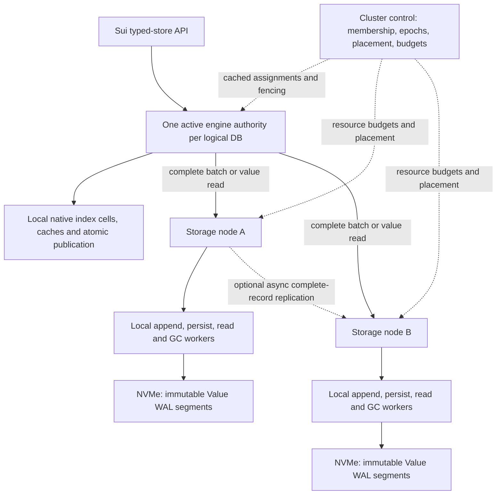

# Distributed Tidehunter: worker hierarchy and sharded Value WAL

Date: 6 October 2026. **Recommended research direction; no implementation or
performance result is claimed.** Substantial native Tidehunter changes are now
allowed. Sui's storage semantics remain the compatibility boundary.

## 1. Recommendation

**Investigate a distributed Tidehunter fork whose Value WAL is physically sharded
across NVMe machines, with one active index/publication authority per logical
database initially.** Keep the existing independent-owner implementation as the
executable reference until the new design passes correctness and performance gates.

Use a hierarchical worker organization:

- Cluster control plane: membership, fencing, placement, capacity and coarse budgets.
- Per-database engine authority: logical ordering, atomic index publication and recovery.
- Node-local workers: append allocation, persistence, reads, cache, replication and deletion.

The global control plane should issue assignments and budgets. Ordinary requests
should use cached assignments to reach the responsible execution node directly.
The local workers should manage their own queues and I/O. There is no reason to
make each local allocator, cache update, flush or map transition an individually
dispatched global job.

The proposed storage unit is a **complete atomic application batch**, kept on one
selected log partition where practical. Different batches can use different NVMe
machines concurrently. A complete durable batch is the proposed commit authority;
its values remain in that log. The intended benefit is eliminating some current
per-key-owner preparation/decision work while retaining native-style publication.
That benefit is conditional on the protocol in §7 being correct.

This first version is distributed value storage. It does **not** distribute one
database's index CPU and memory without limit. Remote index ownership is a later,
separate decision with an additional visibility protocol. Several logical databases
may have different engine authorities. No cluster-wide total order across unrelated
Sui databases is proposed.

**Repository direction:** evolve a fork of native Tidehunter; introduce a new data
path with a clear boundary. Reuse tested transport, Sui integration, audit and campaign
components. Reduce middleware to an adapter as the fork takes over responsibilities.
Deleting the existing system or rewriting all supporting code now would discard
useful comparison and correctness evidence.

## 2. Evidence, dates and scope

This decision follows the complete 14-page paper review and native source inventory
in [the earlier October 6 review](native_correctness_and_storage_options_2026-10-06.md).
Three parallel reviews covered native workers/correctness, DynamoDB/TiKV, and shared
logs/disaggregated storage. Primary papers, official documentation and project code
were used. AWS MCP documentation search/read succeeded for DynamoDB this turn.

| Record | Current relevance |
| --- | --- |
| This document | Latest recommended research direction after permission for substantial engine changes |
| [October 6 correctness inventory](native_correctness_and_storage_options_2026-10-06.md) | Required native properties, source concerns and broader alternatives remain applicable |
| [October 6 independent-owner plan](native_parity_design_plan_2026-10-06.md) | Alternative A; parallel durable staging remains a proposal, not implemented machinery |
| [October 6 timing report](local_operation_timings_2026-10-06.md) | Reduction of the October 5 local executable, not a new October 6 replay |
| [October 5 implementation record](local_remaining_work_2026-10-05.md) | Current coverage/scalar/fabric implementation; precedes this proposal |
| [October 4 cluster report](publication_pipeline_cloud_results_2026-10-04.md) | Latest relevant independent-NVMe comparison; does not measure October 5 code or the proposed fork |
| September plans and earlier October 4 design | Historical motivations and measurements; completion lists and architecture choices must not override newer source evidence |

Reviewed native HEAD: `0c9ec5b4266a716fbac14cb12da97744e9a5e08b`. The two project
commits above `ce37b18` add explicit durable sync and retained/prepared/reference
publication facilities, among other changes. They are not features established by
the paper alone. Middleware HEAD is `1969983bdd1244ef940686da824f48c35442b72f`,
with existing working-tree changes. Sui HEAD is
`c79040af6c06417245e24574246ada38a99d8b30`.

### Why consider a larger architectural change?

| Observation | What it supports | What it does not establish |
| --- | --- | --- |
| October 4 cluster: new TCP 11.501 s versus native 5.399 s, 2.130×; fixed EFA 14.133 s, 2.617× native | A gap remains with independent owner NVMe devices | The fork's performance; hardware RDMA-read performance; identical-build TCP/EFA causality |
| October 5 local: 90,933 owner WAL-file syncs versus 21,772 native, plus 11,987 coordinator barriers | Durability work is amplified by the current protocol | An additive wall-time decomposition or a prediction from the 4.18× count ratio |
| Local coordinator barrier mean 1.920 ms; about 4.09 owners per multiowner wave | Multiowner commit is a relevant target for this workload | That moving thread scheduling globally will remove the barrier |
| Local full-map routing mean 0.707 µs | The full-map lookup is not the demonstrated millisecond bottleneck | That all routing strategies or placement choices have identical performance |
| Native prepared-value references already avoid eligible duplicate payload writes | Preserve this mechanism's value-sharing goal | A claim that a speculative second full-value WAL explains the measured gap |

The local owners share one NVMe. The cluster uses older binaries and has limited
repetitions and missing EFA diagnostics. Timers overlap. This proposal makes no
quantitative speedup forecast from those observations.

## 3. What “distribute Tidehunter's workers” actually means

The paper's §3.1 and Figure 4 distinguish foreground allocation/copy/index work
from background mapping, persistence and reclamation. Its synchronous controller
is local code and atomic allocation, not an existing network task coordinator.
The implementation also has workers introduced beyond the paper's description.

Source paths below are relative to the native repository's `tidehunter/src/`.

| Role | Verified code behavior | Proposed location |
| --- | --- | --- |
| Foreground batch caller | `db.rs`, lines 753–911: append, group by cell mutex, install pending entries, commit shared transaction status | Per-DB engine authority; submit a coarse storage operation |
| Optional Rayon commit pool | `db.rs`, lines 148 and 832; `config.rs`, line 171: optional local parallel application of cell groups | Beside the index cells; remote groups would need a new publication protocol |
| WAL allocator | `wal/allocator.rs`, line 32; `wal/mod.rs`, line 104: reserve nonoverlapping physical ranges | On the node owning that append stream |
| WAL tracker | `wal/tracker.rs`, lines 128 and 193: guard completion and prefix latches | Local storage tracking plus separately defined logical frontiers |
| Mapper and syncer | `wal/mapper.rs`, line 161; `wal/syncer.rs`, lines 24 and 52: map ahead, manage buffers, flush mappings | On the storage node |
| Unlinker | `wal/mapper.rs`, lines 41–125: close/unlink while respecting local reader references | On storage node, after remote lifetime proof permits retirement |
| Index flushers | `flusher.rs`, lines 109–160: route each cell consistently and process its flush queue | On the index owner |
| Pending/flat promotion | `db.rs`, lines 1559–1610: promote committed state and compact in-memory representation | Local to the index |
| Relocator | `relocation/mod.rs`, lines 131–199: copy values, update references, advance safe reclamation | Coarse assignment may be global; copy and I/O local, installation approved by index authority |
| Snapshot worker | `db.rs`, lines 387–425 and 1381–1464 | Per-DB snapshot authority, with local storage/index work |

Sources: [DB](../../tidehunter/tidehunter/src/db.rs),
[WAL](../../tidehunter/tidehunter/src/wal),
[flusher](../../tidehunter/tidehunter/src/flusher.rs),
[relocation](../../tidehunter/tidehunter/src/relocation).

The middleware already has distributed admission and publication scheduling:
[`wave_scheduler.rs`](../crates/client/src/storage/wave_scheduler.rs) bounds active
jobs at two, and [`wave.rs`](../crates/client/src/storage/wave.rs) prepares owners,
waits for the publication turn, persists a decision, and applies it under the
visibility protocol. [`group_commit.rs`](../crates/worker/src/storage/group_commit.rs)
already groups compatible owner work. More scheduler threads do not remove those
dependencies. Safe concurrency requires changing the ownership and commit rules.

Global maintenance coordination can still help: assign relocation bandwidth, avoid
simultaneous repair/GC storms and reserve capacity for recovery. These are resource
management benefits, separate from atomic-commit cost.

## 4. What other systems actually teach us

### 4.1 Modern DynamoDB, not just Dynamo

The **2022 DynamoDB paper** describes partition replication groups with leaders,
quorum-persisted WAL writes, request routers, metadata services and fleet administration.
Storage replicas also maintain B-trees; log-only replicas are not permanent-value
WALs. Its global admission controller supplies token budgets that routers consume
locally, rather than approving each disk operation. This supports global management
with local execution. It does not establish a Tidehunter-like shared value log.
[DynamoDB, ATC 2022, §§3–6](https://www.usenix.org/system/files/atc22-elhemali.pdf).

The **2023 transaction paper** describes a coordinator fleet, a durable transaction
ledger and participant prepare/commit. Singleton operations bypass this protocol;
a single-partition optimization reduces transaction rounds. Therefore a scalable
worker hierarchy can coexist with expensive cross-partition atomicity. The relevant
lesson for us is to examine how many independent persistence participants a batch
needs. The publication is a documented design at that date, not disclosure of every
current internal implementation detail.
[DynamoDB transactions, ATC 2023](https://www.usenix.org/system/files/atc23-idziorek.pdf).

Current APIs distinguish atomic transaction operations from ordinary batch APIs.
Separate reads can straddle transaction visibility; an atomic transactional read
has a different contract. We must preserve Tidehunter's actual API guarantees,
not import either stronger promises or weaker batch semantics by analogy.
[DynamoDB transaction API/isolation](https://docs.aws.amazon.com/amazondynamodb/latest/developerguide/transaction-apis.html).

The original **Dynamo, SOSP 2007**, favors availability and reconciliation and uses
direct routing with locally available membership information. Cached placement is
relevant. Accepting conflicting writes and reconciling later is not a substitute
for our required atomic batches and ordering.
[Original Dynamo paper](https://www.allthingsdistributed.com/files/amazon-dynamo-sosp2007.pdf).

### 4.2 Other implementation and academic references

| Source | Mechanism to study | Boundary of the analogy |
| --- | --- | --- |
| [TiKV placement](https://tikv.org/docs/6.1/reference/architecture/scheduling/), [PD code](https://github.com/tikv/pd/blob/8c1783d11fdb65f71df792e0b6b2811996b69389/pkg/schedule/schedulers/balance_leader.go#L304), [Rust transaction scheduler](https://github.com/tikv/tikv/blob/49e7a1179d676b1bc51447f6b0ff8973e45bc85f/src/storage/txn/scheduler.rs#L395) | Placement/balancing issues administrative actions; transaction latches, queues and budgets remain local | Its Region/replication design does not eliminate multi-Region transactions or supply WAL-as-values. Docs are versioned; code links pin reviewed revisions. |
| [CORFU, NSDI 2012](https://www.usenix.org/system/files/conference/nsdi12/nsdi12-final30.pdf) | Separate logical positions from flash placement; seal failed epochs and resolve holes | Missing reservations become a protocol problem; its fault model and old performance figures do not predict ours |
| [CorfuDB transaction code](https://github.com/CorfuDB/CorfuDB/blob/master/runtime/src/main/java/org/corfudb/runtime/object/transactions/OptimisticTransactionalContext.java), [stream append](https://github.com/CorfuDB/CorfuDB/blob/master/runtime/src/main/java/org/corfudb/runtime/view/StreamsView.java) | Collect several object updates in a `MultiObjectSMREntry`, append with affected streams, handle conflicts/epochs | Established precedent for one multi-object authority record; it does not implement Tidehunter relocation or prove our adaptation novel |
| [Scalog, NSDI 2020](https://www.usenix.org/system/files/nsdi20-paper-ding.pdf) | Order cuts from distributed logs and amortize progress reports | Scalog-Store writes key/value records, then a commit record, then updates a mapping server. It is not our one-complete-batch append. Periodic ordering and mapping can hurt dependent/tail latency. |
| [FoundationDB, SIGMOD 2021](https://www.foundationdb.org/files/fdb-paper.pdf), [commit path](https://github.com/apple/foundationdb/wiki/Transaction-Commit-Path), [log retention](https://github.com/apple/foundationdb/blob/main/design/tlog-spilling.md.html) | Separate durable log authority from storage application; track applied/durable versions and consumer retention | Reads can wait for storage progress. Ordinary storage servers persist values too; copying that entire path would weaken our goal of one long-term value location. Commit-path documentation is historical. |
| [TeRM, FAST 2024](https://www.usenix.org/system/files/fast24-yang-zhe.pdf), [artifact](https://github.com/thustorage/TeRM) | Resident RDMA reads with explicit RPC/I/O for SSD-resident data | Driver/kernel-specific artifact, not an EFA-ready WAL. Ordinary RNIC on-demand paging was costly in its experiments. |
| [SPDK target](https://spdk.io/doc/nvmf.html), [worker model](https://spdk.io/doc/nvmf_tgt_pg.html) | Local poll groups process normal I/O; management changes coordinate less frequently; TCP/RDMA transports | Exposes blocks, not complete Tidehunter batches or their reachability. The programming guide's “only RDMA” sentence is stale; use the target guide for transports. |

These references support the component boundaries. They do not select a winner
for the Sui workload or establish identical durability/security/performance modes.

## 5. Architecture alternatives and selection

| Alternative | Main advantage | Main unresolved cost | Decision for this project |
| --- | --- | --- | --- |
| A. Independent complete Tidehunter owners | Local index/value lookup and local recovery/GC; natural key ownership | Frequent multiowner batches need distributed outcome/publication | Retain as measured reference and viable fallback; attractive when batches are mostly owner-local |
| B. A plus a universal global job dispatcher | Centralized resource scheduling | Adds queues/hops without removing commit obligations; can bottleneck the whole fleet | Do not select as the performance architecture; extract only coarse control-plane ideas |
| C. Native fork with per-DB logical batch authority and distributed Value WAL | Can reduce a multi-key batch to one storage authority while keeping atomic publication local | Major address/order/recovery/GC changes; frontend CPU/NIC/index limit | **Preferred research candidate**, subject to §11 |
| D. One native engine over remote NVMe-oF block storage | Standard block interface; may preserve more local engine code | Filesystem/flush propagation, network I/O, one frontend limit, stripe failure exposure | Comparison candidate; evaluate if custom-log complexity cannot be justified |
| E. Shared log plus distributed index authorities | Scales index CPU/memory as well as values | Read-version protocol, partial apply, global snapshots and retention become distributed | Later research only if C's index authority is the measured limit |
| F. Replace native storage with sharded full LSM engines | Mature existing storage implementations and possible small-value advantages | Cross-owner commit remains; large-value compaction and migration costs | No current measurement justifies prioritizing this replacement |

Permission to change native code removes the previous implementation constraint
favoring A. The evidence still does not prove C is faster. C is selected for further
design because it changes the authority boundary responsible for measured work,
while preserving Tidehunter's values-in-WAL principle.

## 6. Proposed worker and ownership architecture



The engine authority can be embedded in the Sui process initially, avoiding an
additional application-to-router hop. Several caller threads can operate within
that authority; it does not mean a single execution thread. Locally sharded cell
locks and native transaction publication remain useful.

Each node has an independent physical append allocator. The database has a logical
ordering domain. “Global WAL” here means a shared logical database history with
distributed physical segments, not one physical file, one payload server, or a
sequencer for all unrelated databases in the fleet.

The storage node need not run a second complete authoritative KV index for every
key in each frame. It needs record/segment lookup, validation, durable append and
retention state. Independent Tidehunter owner databases would cease to be the
authority on this path. That is a substantial native/middleware redesign.

### Proposed storage operations, not implemented interfaces

- `append_complete_batch`: authenticate and validate identity, placement epoch and
  format; append the whole batch; return the declared completion evidence.
- `persist_through`: explicitly establish a durable local stream prefix where the
  acknowledgement mode or grouping requires it.
- `read_record`: return an identified frame/value under a protected lifetime.
- `seal_epoch`: fence old append authority and establish a recovery boundary.
- `retire_segment`: execute only with sufficient durable mapping/lifetime evidence.

These contracts should have TCP and optional fabric implementations. Choosing a
Rust transport wrapper or library does not define the storage semantics.

### Preserve bounded progress

Limit in-flight batch bytes/counts, pending publication, registrations, replica lag
retention and GC work. Reserve progress capacity for fencing/recovery. Apply
backpressure when credits are exhausted; increasing queue depth without such bounds
can move the gap into memory pressure or tail latency. Native channels are not all
bounded, so this is a new distributed design obligation, not an inherited proof.

## 7. Decisive questions: proposed answers and proof obligations

### 7.1 Can one record replace the current commit authority?

**Conditionally yes.** Define a complete, validated, durable batch on an authorized
stream as irrevocable commit evidence. Semantic validation, admission, canonical
identity/digest checks and epoch authorization must finish **before a recoverable
complete frame can exist**. Otherwise recovery could adopt bytes from an operation
that was subsequently rejected. A CRC-valid frame is not automatically eligible
commit authority. There is no later discretionary abort because an index worker is slow.
For durable-mode success, publish the corresponding index transaction before
returning. A crash between durable append and publication is repaired by replay.

Proposed states:

```text
validated/reserved → append in progress → durable complete batch → published → acknowledged
                                             |
                                             └→ replay publication after a crash
```

This sketch is not a formal model. The proposed deterministic recovery rule is to
include every complete, authority-eligible batch found in the sealed inventory,
including unacknowledged batches. Eligibility includes identity/digest consistency,
authorized stream/epoch and completed validation; checksum validity alone does not
establish it. Once effects are possible, failure is an unknown outcome rather than
definite rejection. Live durable success still requires storage synchronization.
A checksum or complete memory buffer alone is not proof of persistence.

Place one complete batch on one log partition initially. That avoids a per-key-owner
decision, while parallel batches use several drives. Large single batches cannot
thereby use all drives concurrently. Oversized batches must either fit a defined
single-partition segmented format or be rejected before effects; silently splitting
them into independently committed sub-batches would change the API. Preserve the
existing accepted batch-size limits; reducing them is a compatibility change.
Multi-partition
batch striping would require an additional all-fragments commit rule.

### 7.2 How do identity, order and physical placement differ?

Keep separate concepts:

```text
BatchId              = database + original operation identity
RequestAuthority     = current fenced writer epoch
MutationVersion      = original ordering epoch + per-epoch sequence + operation index
PhysicalValueAddress = partition + segment generation + offset + length
```

Exact types are undecided. Epochs must have a durable, comparable ordering, or the
implementation must prove a recovered monotonic sequence across restarts. A retry
after failover retains the original `BatchId`, digest and assigned mutation version;
its request uses the new authorized fencing epoch. It must not become a new operation
or overwrite a later mutation merely because the submitting authority changed.
The original identity may itself include its creation epoch, but that identity is
immutable. Retrying an existing committed batch means finding or replaying that
outcome. Once a sealed reservation is definitively absent, it stays terminal:
return not-committed/expired rather than re-append its old version. Execution anew
requires an explicitly new identity/version. A single active engine authority can
assign logical order locally, avoiding a separate remote sequence request for every write. Native
same-key last-write rules must use logical versions; node-local offsets are not
comparable user versions. Duplicate keys within a batch keep the native semantics.
Relocation changes the physical address without creating a new user mutation.

Native anchors: [`WalPosition`](../../tidehunter/tidehunter/src/wal/position.rs),
[`skip_stale_update`](../../tidehunter/tidehunter/src/large_table.rs),
[relocation updates](../../tidehunter/tidehunter/src/relocation/updates.rs).

### 7.3 What about holes, failed writers and discovery?

A durable, versioned inventory must identify authorized streams/segments before
they accept authoritative batches. Registering a segment/epoch can be amortized
over many batches; requiring another frontend durable registration per batch would
reintroduce work this candidate is intended to remove.

After an authority failure, the recovery protocol must:

1. Freeze the failed epoch's versioned stream inventory and exclude its writer
   from further registration, removal or placement changes. Recovery must not seal
   one set while an old writer can add another authorized stream.
2. Obtain exclusive authority for a new epoch and fence the old writer on every
   relevant stream, or establish equivalent fencing under a proved replica protocol.
3. Seal the old epoch and obtain authoritative surviving/durable stream boundaries.
4. Enumerate the complete registered inventory, not only responsive machines.
5. Recover complete batches and their logical order, including acknowledged records
   after gaps in another stream.
6. Classify absent reservations only when fencing and inventory prove they cannot
   arrive later. Resume service after reconciliation.

Timeout is not an abort or permission to fill a hole. In normal operation, a gap
may stall sync/snapshot progress; early cancellation needs durable terminal evidence
or an equivalent seal rule. Native replay's local torn-tail truncation cannot simply
be applied to the union of remote logs. Losing an RF1 stream may prevent recovery.

For the first protocol model, publish only through a contiguous logically resolved
prefix. Each position is either an authoritative batch or a proved terminal hole;
a timeout cannot establish the latter. A snapshot names that logical cut, its exact
index state and the required replay boundary for **every** registered stream.
Maximum observed sequence/offset values are insufficient. Retain unresolved and
later committed history until a snapshot/replay proof permits retirement. Publishing
disjoint batches across gaps is a possible later optimization with its own snapshot
proof. The conservative first model may incur head-of-line delay; measure this
explicitly before accepting it as a performance architecture.

### 7.4 Can publication stay local without becoming the next limit?

Initially retain one active index authority per DB. Native pending entries share
transaction status, allowing atomic eligibility after all entries are installed.
[Pending table](../../tidehunter/tidehunter/src/index/pending_table.rs),
[batch publication](../../tidehunter/tidehunter/src/db.rs).

Keep a bounded index/value cache; the full index is not assumed to fit RAM. Explicitly
choose where persisted index blobs and control snapshots live. Their recoverability
is required even if they are off the foreground commit path. A frontend failure
requires accessible snapshots plus retained log suffixes, or a proved reconstruction
path from authoritative data. GC must preserve that path.

A cached-index cold-value read can use one storage exchange. A remote index miss
followed by a remote value read may need two dependent exchanges. Scans can scatter
across storage partitions and need bounded parallel fetch with preserved ordering.
Native RAM hits still have a different latency floor.

If multiple index authorities are introduced later, shared-memory transaction status
is insufficient. Specify committed versions, applied frontiers, cache coherence and
snapshot semantics first. Deferred index application can shift waiting into reads.

### 7.5 How do relocation and remote readers remain correct?

Tidehunter's Value WAL is long-term value storage. Applying a batch to an index does
not make its values disposable. The paper's §4.4 describes relocation; native code
uses conditional pointer replacement to avoid overwriting newer writes.

Required retirement sequence:

```text
protect source → copy live data → persist replacement
→ conditionally install mappings → persist recovery metadata
→ revoke/drain old read capabilities → satisfy snapshot/replica retention
→ delete or reuse old segments
```

The exact proof may permit overlap, but cannot omit an obligation. Reader references
such as native `Arc<File>` do not extend across hosts. RDMA needs bounded registered
windows and explicit lifetime/revocation rules. Segment generations prevent stale
addresses from naming unrelated reused bytes. GC workers execute locally using
coarse budgets and validated retirement authority; a scheduler cannot infer liveness
from age or a timer alone.

### 7.6 What must asynchronous replication copy?

Replicate complete authoritative frames, identities, ordering/epoch metadata and
required stream/snapshot manifests. Values alone are insufficient. A node may host
its own primary streams and secondary streams from other nodes, with separate
authority and resource budgets.

Track local durability, replica durability, publication, snapshot and GC progress
separately. Promotion must fence old writers and prove a consistent recoverable
state. Async replicas may lack acknowledged primary writes; zero-loss failover
would require a stronger acknowledgement policy. RF1 comparisons must retain the
same permanent-disk-loss assumptions as the native baseline.

### 7.7 What are retry and failure outcomes?

| Event | Required treatment |
| --- | --- |
| Request rejected before any effect | Definite rejection may be returned |
| Append reply lost or persist error after possible effects | Unknown outcome; resolve by stable batch identity and payload digest |
| Durable batch, frontend dies before index publication | Recover and publish; do not later abort it |
| New writer starts while old requests remain in flight | Storage rejects the fenced epoch; stale completions cannot publish new state |
| Index snapshot stored but required values unavailable | Do not expose a falsely recovered DB |
| Storage partition unavailable during gap resolution | Wait or fail recovery safely; do not treat silence as absence |
| Old read capability survives relocation | Keep old representation protected or enforce revocation/drain before reuse |
| Async secondary is behind when primary is permanently lost | Report the declared recovery limitation; do not claim native-durable zero loss |
| Very old retry after outcome/segment retirement | Use a defined retention floor/expired-outcome rule; never silently execute it as a new operation |

This table describes obligations. None of the new distributed states or transitions
has been model-checked or implemented.

## 8. RDMA, NVMe-oF and cluster choice

The architectural decision precedes the hardware choice. TCP can implement the
same log contract and remains the reference path. A faster transport should preserve
the same acknowledgement, authentication and confidentiality rules.

| Path | Suitability for the candidate | Important limit |
| --- | --- | --- |
| Custom log service over TCP | Portable reference; append/persist/read/retire semantics visible to storage node | Copies, CPU and protocol overhead must be measured |
| Custom service over EFA/libfabric | Plausible AWS transport, with exact capabilities verified | Provider/progress behavior and device support vary; previous EFA RPC timings do not measure this design |
| Resident-window RDMA reads | Optional fast path after index resolves a protected address | Cold SSD values need explicit I/O; memory completion is not SSD durability |
| NVMe/TCP or NVMe/RDMA | Standard block boundary for alternative D | Does not supply batch authority, logical ordering, metadata recovery or GC by itself |

AWS lists hardware RDMA read/write support by instance type. EFA is not synonymous
with a generic RoCE/InfiniBand transport. The ordinary SPDK NVMe/RDMA path uses
verbs/RDMA-CM; EFA's driver-specific interfaces mean compatibility cannot be assumed
from an EFA checkbox. A custom EFA log protocol and standard NVMe/RDMA are different
deployment paths. [AWS EFA](https://docs.aws.amazon.com/AWSEC2/latest/UserGuide/efa.html),
[libfabric provider](https://ofiwg.github.io/libfabric/main/man/fi_efa.7.html),
[EFA verbs](https://github.com/linux-rdma/rdma-core/blob/master/providers/efa/verbs.c).

A conventional RoCEv2/InfiniBand cluster is a reasonable candidate if standard
NVMe/RDMA or a specific driver interface is essential. Verify device access, local
NVMe, NUMA layout, network topology and supported software before selecting it.
Do not move providers solely because the old EFA RPC stream was slower than TCP.
TeRM's artifact is a useful design reference but its modified-driver requirements
are not evidence of drop-in EFA support.

Compare total host cost, dedicated progress CPU, memory registration, network traffic,
replication and recovery capacity. No price or hardware throughput is assumed here.
No cluster selection, account change or launch is authorized by this document.

## 9. Repository layout and change ownership

The following is a future work map. Proposed modules are **not present yet**.

| Repository / existing area | Required change for C | Size / reuse decision |
| --- | --- | --- |
| `tidehunter/tidehunter/src/wal/{position,allocator,mod,tracker}.rs` | Separate logical versions and physical addresses; define local/remote append completion and stream progress | Major; preserve local backend as correctness/performance reference |
| `tidehunter/tidehunter/src/db.rs`, `batch.rs`, `index/`, `large_table.rs` | Complete-batch submission, remote value resolution, logical-version ordering; keep atomic local publication | Major; format and index representation may change |
| `tidehunter/tidehunter/src/wal_replay.rs`, `control.rs`, `state_snapshot.rs` | Versioned stream inventory, epoch sealing, replay across streams and durable snapshot references | Major; new recovery model, not a transport wrapper |
| `tidehunter/tidehunter/src/relocation/`, `file_reader.rs`, `iterators/` | Remote address lifetimes, conditional remapping and distributed retention | Major; preserve iterator/checkpoint contract and unsupported configuration limits |
| Proposed native `distributed/` module and a workspace storage-node crate | Contract types, epoch/recovery state machine and local storage service | New engine components; names/layout finalized after interface design |
| `middleware/crates/client/src/storage/` | Existing owner prepare/decision, wave scheduling and coverage become baseline-specific | Replace on the new path only after its equivalent authority/recovery is established |
| `middleware/crates/worker/src/storage/` | Reuse validation, metrics, identity and fault cases; new storage service owns complete-frame semantics | Selective reuse; do not carry the entire old participant protocol into the fork |
| `middleware/crates/transport/`, `protocol/`, `rdma-fabric-sys/` | Reuse bounded framing, TLS, deadlines, unknown-outcome handling and transport infrastructure where suitable | Audit and adapt; version protocols and keep genuine TCP/fabric equivalence |
| `middleware/crates/tidehunter-facade/` | Become a thin API/deployment adapter for the fork | Significant simplification later; avoid two independent visibility authorities |
| `middleware/experiments/sui/`, `experiments/aws/`, audit tools | Preserve real workload, result export, source/binary identity and cleanup; add explicit fork backend identity later | Reuse; prove the new backend is actually exercised |
| `sui/crates/typed-store/src/rocks/mod.rs` and existing storage hooks | Select the backend with the same API and error semantics | Aim for minimal adapter/config changes; no assumed consensus or execution redesign |

Useful entry points: [native workspace](../../tidehunter/Cargo.toml),
[native DB](../../tidehunter/tidehunter/src/db.rs),
[middleware coordinator](../crates/client/src/storage/wave.rs),
[owner WAL integration](../crates/worker/src/storage/native_journal.rs),
[facade](../crates/tidehunter-facade/src/db.rs),
[Sui typed-store](../../sui/crates/typed-store/src/rocks/mod.rs).

Maintain explicit on-disk and wire format versions. Specify migration/export and
rollback before replacing existing data. A new fork should preserve history and
reusable tests. It does not require a from-scratch Rust storage engine or immediate
deletion of middleware. No commit, branch, push or code change is made in this turn.

## 10. What could be novel?

Shared logs, partitioned storage, hierarchical worker scheduling, separated indexes
and RDMA caches all have extensive prior art. Calling the project “distributed
Tidehunter with RDMA” is not enough to establish novelty.

A possible research contribution is the combination of:

1. Complete-batch authority in a physically distributed, long-lived Value WAL.
2. Preservation of Tidehunter's atomic publication and low value rewrite cost.
3. Recovery and relocation proofs that cover remote readers and async replicas.
4. Fewer durable coordination stages on real Sui workloads, with bounded resources.

These are proposed contributions, not established novel results. CorfuDB already
provides precedent for multi-object log entries. A systematic related-work review
and a measured distinction are needed before making a publication/novelty claim.
Engineering value does not depend on every component being new.

## 11. Work order and acceptance gates

### Gate 0: settle the reference contract

Retain the [October 6 correctness rules](native_correctness_and_storage_options_2026-10-06.md#3-native-correctness-inventory).
Resolve the **possible native stale cache-refill race**: `Db::get` can read an old
position and `LargeTable::update_lru` refills without a version check. This remains
an unverified source finding, not a reproduced defect. Existing checkpoint lifetime
limits and compression/relocation/index-splitting restrictions also need explicit
coverage. Native source audit questions include joining background threads at drop
(`db.rs:218`), releasing relocated-write guards before index flushing (`db.rs:940`),
and the noted compactor/in-memory-index synchronization case (`flusher.rs:492`).
These TODOs are not demonstrated defects. Do not inherit a stronger guarantee than
the implementation has demonstrated, or copy a suspected race into the new engine.

### Gate 1: protocol model before implementation

Model two log nodes, one logical DB, two conflicting/disjoint batches, index
publication, snapshot, lost replies, torn tails and writer replacement. Extend it
with one delayed async replica and a concurrent protected read during GC.

Check invariants: no partial visible batch; acknowledged data survives the declared
failures; same-key order does not regress; fencing excludes old writers; every
authoritative frame is discoverable; retired bytes are unreachable; retry identities
cannot obtain contradictory outcomes; bounded credits still permit recovery.

Compare the extra work against A and D. If C needs another mandatory decision
barrier, inventory sync per batch or most reads waiting for a global gap, revisit
its cost advantage rather than assuming the fork will be faster.

### Gate 2: minimal future engine fork

Only after the model: preserve the native local backend and build the new log
backend with explicit mode identity. Start with static registered streams and one
active index authority. Validate data/recovery and bounded concurrency locally.
Dynamic migration, distributed indexes and fabric-specific reads are separate gates.

### Gate 3: mechanism measurements

Measure append admission, local allocation, transport/service, persistence,
publication, gap waiting, reads by cache source, index misses, replica retention
and relocation. Count payload copies, physical bytes, RPCs and durability barriers.
Use correlated spans; overlapping timer sums cannot partition replay wall time.

Compare the same native API/durability/security mode and workload. Include all
remaining drain work so deferred costs do not masquerade as a speedup. Verify the
fork is in the executable and the old participant path is not silently serving it.

### Gate 4: independent NVMe only when justified

Later matched old/new cluster tests must identify fresh source/binary hashes,
exact hardware/provider capabilities and complete results. Separate dependent Sui
replay from saturated parallel throughput, cold reads and sustained relocation.
Retrieve evidence and close owned resources. No cluster runs are part of this task.

### Selection after evidence

- Adopt C if it preserves the contract and materially improves the relevant workload
  without moving unbounded cost into index progress, recovery or GC.
- Prefer A if owner-local operations dominate or C's frontend limit outweighs its
  reduced transaction fanout.
- Prefer D if standard remote storage achieves the needed capacity/performance with
  substantially less engine/protocol complexity.
- Consider E only after measuring an index-authority limit and specifying its
  distributed visibility contract.

No numerical parity claim is justified yet. The expected opportunity is fewer
durable coordination stages and more useful concurrent NVMe work. A remote cold
read, a local RAM hit and a replicated durable write have different latency floors.

## 12. Completion record

- New design recommendation and repository work map written; older documents linked
  by filename date and relevance.
- DynamoDB, Dynamo, TiKV, CORFU/CorfuDB, Scalog, FoundationDB, TeRM and SPDK compared
  through primary sources. Published architecture dates and implementation limits
  are kept separate from our proposed adaptation.
- Native worker map and all seven decisive questions reviewed in parallel.
- No source edits, benchmarks, dependency installation, git mutations or cloud
  resource operations. The existing source concerns remain open and visible.
